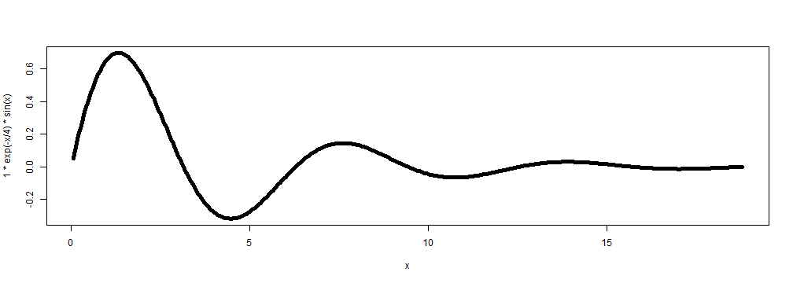

## Index

1. What is shiny?
2. ur.R and server.R files
3. Example of use: selecting sin(x)
4. Improving the application: Future extension

--- .class #id 

## What is shiny?

**Shiny is a new way to build web applications with R.**
#For additional information on the data, please refer to: http://shiny.rstudio.com/   
 * ui.R file: It is used to set the appearance or interface in the application:

```r
shinyUI(
    pageWithSidebar(
        headerPanel("Graphic these functions"),
        sidebarPanel(h2('select the function to print')) # Add items input
        mainPanel(h2('The...'),verbatimTextOutput("funcion"))) #Add items output
```

 * server.R file: It is used to make the calculation needed:

```r
shinyServer(function(input, output) {
        output$funcion <- renderPrint({input$rb})
        output$canvas <- renderPlot({plot(x, y = (input$k)*exp(-x*input$t))})}) #Add plot
```

--- .class #id 

## Example of use

The grafical output that should be printed is shown here:   
![alt text][id]
[id]: ExampleOfUse.png "Title"


--- .class #id 

## Futures improvements:

- Change the radio button by checkable button in order to construct more complex functions by multipling the functions availables. For example $e^(-x) · sin(x)$
- The expected output for t = 0.25 and k = 1 will be like this:

```r
x <- seq(from=0.05, to=6*pi, by=0.05)
plot(x=x, y = 1*exp(-x/4)*sin(x), type ="l", lwd = 5)
```

 


